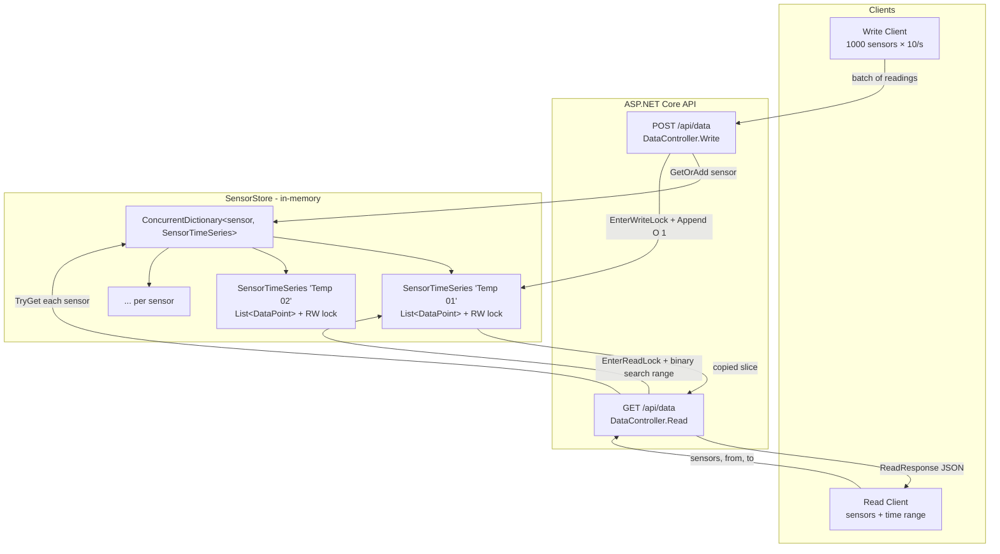

# SensorApi

An ASP.NET Core (.NET 8) Web API that accepts and returns sensor time-series data from an in-memory store. Built for **Challenge 1 — Storing sensor data via an endpoint in memory (high performance, high throughput)**.

## What the challenge asks for

> Implement a service with two endpoints:
> - **Write** — store data for one or more sensors in a memory structure optimized for fast retrieval; multi-thread safe.
> - **Read** — return data for one or more sensors within a requested time range; multi-thread safe; must handle ≥ 10,000 values per request without crashing or blocking.
>
> Plus: in-memory only, sustain many write clients (1,000 sensors × 10 pts/s each), and at least one integration test.

## How this solution maps to the requirements

| Requirement | Where it lives |
| --- | --- |
| `POST /api/data` write endpoint | [DataController.cs:16-24](SensorApi/Controllers/DataController.cs#L16-L24) |
| `GET /api/data` read endpoint with sensors + time range | [DataController.cs:30-43](SensorApi/Controllers/DataController.cs#L30-L43) |
| Memory structure optimized for fast retrieval | [SensorStore.cs](SensorApi/Services/SensorStore.cs) — per-sensor time-sorted list, binary search on read |
| Multi-threaded safety | `ConcurrentDictionary` for the sensor map + `ReaderWriterLockSlim` per sensor ([SensorStore.cs:62-101](SensorApi/Services/SensorStore.cs#L62-L101)) |
| ≥ 10,000 values per request without crashing/blocking | [DataEndpointTests.cs:88-108](SensorApi.Tests/DataEndpointTests.cs#L88-L108) |
| Concurrent writers | [DataEndpointTests.cs:111-130](SensorApi.Tests/DataEndpointTests.cs#L111-L130) |
| Integration test (xUnit + WebApplicationFactory) | [SensorApi.Tests/](SensorApi.Tests/) |

## Design at a glance

The store is a **dictionary of per-sensor time-series buckets**. Each bucket holds a `List<DataPoint>` kept sorted ascending by timestamp.

- **Writes are O(1) appends.** Sensor clients emit data chronologically, so we just append to the tail.
- **Reads are O(log n + k).** We binary-search for the lower and upper bounds of the requested range, then return the slice.
- **Locking is per-sensor.** Two writers targeting different sensors never contend. Reads on a sensor never block other reads on the same sensor (`ReaderWriterLockSlim`). Lookups in the sensor map itself are lock-free (`ConcurrentDictionary`).
- **Read returns a copied slice**, so callers never hold a reference into the locked list.

## Flow chart



## API

### Write — `POST /api/data`

Body:

```json
{
  "readings": [
    { "sensor": "Temperature 01", "timestamp": "2025-11-19T12:00:00Z", "value": 78.3 },
    { "sensor": "Temperature 01", "timestamp": "2025-11-19T12:00:00.1Z", "value": 78.4 },
    { "sensor": "Temperature 02", "timestamp": "2025-11-19T12:00:00Z", "value": 21.1 }
  ]
}
```

Returns `202 Accepted`. Clients are expected to **batch one tick across all their sensors into a single call** to minimize HTTP overhead — at 1,000 sensors × 10 pts/s that is 10 requests/sec/client instead of 10,000.

### Read — `GET /api/data?sensors=A&sensors=B&from=...&to=...`

Repeated `sensors` query parameters; ISO-8601 timestamps for `from` and `to`. Returns:

```json
{
  "results": {
    "Temperature 01": [{ "timestamp": "...", "value": 78.3 }, ...],
    "Temperature 02": [{ "timestamp": "...", "value": 21.1 }, ...]
  }
}
```

Sensors that have no data (or do not exist) return an empty array.

## Running

```powershell
dotnet run --project SensorApi
```

The API listens on the default Kestrel ports printed at startup.

## Testing

```powershell
dotnet test
```

The integration suite ([DataEndpointTests.cs](SensorApi.Tests/DataEndpointTests.cs)) spins up the real API via `WebApplicationFactory<Program>` and exercises:

- single-batch write → 202
- write/read round-trip
- time-range filtering
- multi-sensor reads
- **10,000-point read** (challenge requirement)
- **concurrent writers** to the same sensor

## Why these choices

- **`List<DataPoint>` over `SortedDictionary` / `SortedList`** — appends are O(1) for chronological data and the underlying contiguous array makes binary search and slice copies cache-friendly. A tree would be O(log n) per insert with worse constants and worse memory locality.
- **`ReaderWriterLockSlim` per sensor** — the workload is read-light/write-heavy per sensor but lookup-light/read-heavy across sensors, so isolating the lock to the sensor it protects keeps unrelated traffic fully parallel.
- **Copy on read** — frees the lock immediately and prevents the caller from observing later mutations through a live reference.

## Limits / known trade-offs

- Pure in-memory by design — no persistence, restarts lose data.
- Out-of-order writes are appended at the tail; the binary search assumes sorted order. Real ingestion is chronological per the challenge scenario, so this holds in practice. A production version would either reject out-of-order points or insert at the correct index.
- The read endpoint returns the full range in one response. For very large ranges across many sensors, a streaming or paginated variant would be the next step.
